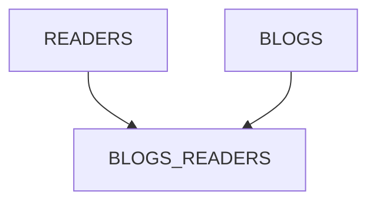

# Test Bandesal
### Dada la siguiente estructura de base de datos que permite almacenar lectores, blogs y lectores por blog; crear una aplicación que permita registrar los lectores, los blogs y los lectores que visitan cada blog.

1. Deberá crear las tablas en el esquema de base de datos seleccionada.
2. Elaborar pantalla de inicio de sesión de usuario. La contraseña almacenada
debe estar cifrada.
Nota: Se solicitará en la demostración agregar un nuevo usuario y
autenticarse con este.
3. Crear la plantilla de la interfaz de usuario de acuerdo con el modelo propuesto
en la figura 2.
4. Para registrar y modificar los lectores por blog deberá hacer uso de listas de
valores.
5. Los ID de los readers y blogs deberán llenarse automáticamente mediante
una secuencia desde la aplicación.
6. Cree el mantenimiento de las tablas readers, blogs y blogs_readers. Para
cada tabla se deberá poder consultar, editar, crear y eliminar sus registros.
Utilice la plantilla antes creada con su respectivo menú.
7. Implemente todas las validaciones que sean necesarias para asegurar la
integridad de los datos y trate de realizar el mejor manejo de errores
posible.
8. Publique la aplicación en el servidor de aplicaciones que desee y cree el
origen de datos necesario para el correcto funcionamiento de la aplicación.

## Consideraciones:
• Puede usar la base de datos de su preferencia.

• Puede usar el servidor de aplicaciones que desee.

• Debe usar Prime Faces para la vista, EJBs y JPA para el manejo de la
persistencia.

## Mapa de entidad relación 

|READERS |  | 
| ------------- | ------------- | 
| Id | `Serial `| 
| Name | `Varchar  `| 

|BLOGS_READERS|  | 
| ------------- | ------------- | 
| Id | `Serial` | 
| ReaderId| `Integer`| 
| BlogId| `Integer`| 

|BLOGS|  | 
| ------------- | ------------- | 
| Id | `Serial `| 
| Title| `Varchar`| 
| Description| `Varchar`| 

# Figura 2

